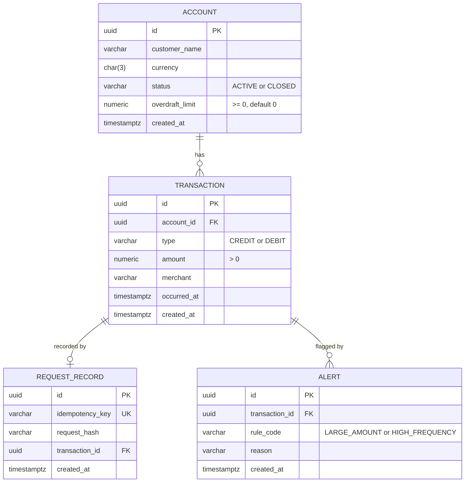

# Data model

## Constraints and rationale

**No stored balance.** Balance is derived by summing the transaction ledger.
The transaction table is the single source of truth; a stored balance can
silently diverge from the history that produced it, and cannot be audited.
Trade-off: read cost grows with ledger size. At scale the answer is periodic
snapshot balances plus a sum of transactions since the snapshot.

**Immutable transactions.** Rows are inserted, never updated or deleted. A
correction is a new compensating transaction, not an edit.

**overdraft_limit on Account.** Stored per account rather than as global
configuration, so limits can vary without a code change. A debit is rejected
when `balance - amount < -overdraft_limit`. This check is a read-then-write and
must be performed inside a single database transaction with row locking;
otherwise two concurrent debits can each pass the check and together breach the
limit.

**Unique idempotency_key.** One record per key. A repeat with a matching
request_hash returns the original transaction; a repeat with a differing hash
returns 409, because a reused key with different content indicates a client
bug rather than a retry.

**request_hash is over the canonical body.** Field order and whitespace are
normalised before hashing, so semantically identical payloads produce identical
hashes.

**Unique (transaction_id, rule_code) on Alert.** A given rule may flag a given
transaction at most once. Separate table rather than a boolean on Transaction,
because alerts are derived interpretation with their own lifecycle, whereas
transactions are recorded fact — and this permits multiple rules per
transaction plus new rules without schema change.